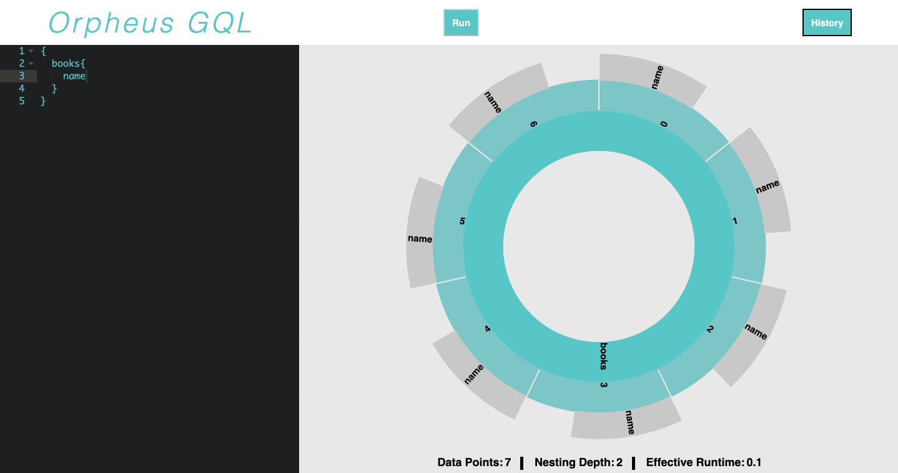
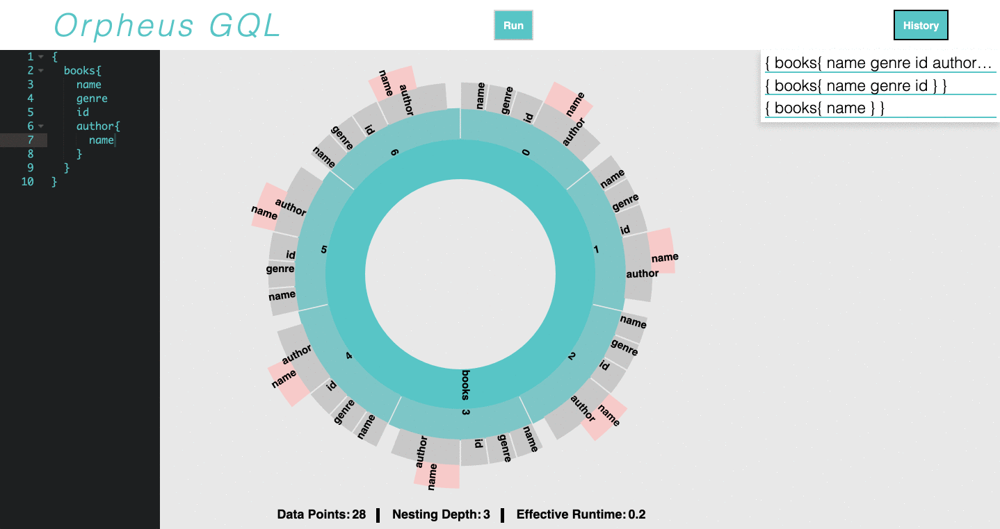

# Orpheus GQL

## Download
```
npm i orpheus-gql
```

## Installation

1. Import OrpheusGQL into your app
2. Configure Orpheus with your endpoint URL
3. Navigate to '/orpheus' to use the GUI

``` javascript
const graphqlHTTP = require('express-graphql');
const orpheus = require('orpheus-gql');
const orph = orpheus.config('http://localhost:[your-port]/[graphql endpoint]');

app.use('/graphql', graphqlHTTP(request=>{
    return {
        schema,
        context: orpheus.context(),
        graphiql: true,
        extensions: orpheus.extension
    }
}))

app.get('/orpheus', orph)
```
## Usage

1. Enter your JavaScript GraphQL query in the code editor on the left


2. Click Run

3. Results will be displayed visually on the graph; scalar values can be viewed below the graph

4. Center of the graph represents entry point into your database

5. Queries that return multiple items will be represented numerically

6. Labels will be given to each resolver of the item

7. History button will reveal archived queries 
displayed in descending order (with the most recent query at the top position)


8. Clicking on a previous query will populate the code editor for it to be executed

